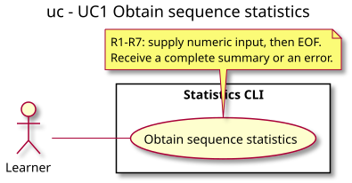

# Use case diagram — sequence statistics

Feature: exercise 01, UC1. Status: proposed, awaiting owner validation.

Source contract: [statistics conception](../../specs/01-statistics.md). Coverage: [traceability matrix](../../traceability-matrix.md).

## Context

Shows the learner goal and system boundary. Error extensions are specified in UC1, not separate actor goals.

## Diagram

[Authoritative PlantUML source](01-use-case.puml).

## Notes

Names and behavior must match the accepted contract. The implementation is still pending. Regenerate the SVG from PlantUML after every diagram change; never edit the SVG manually.
