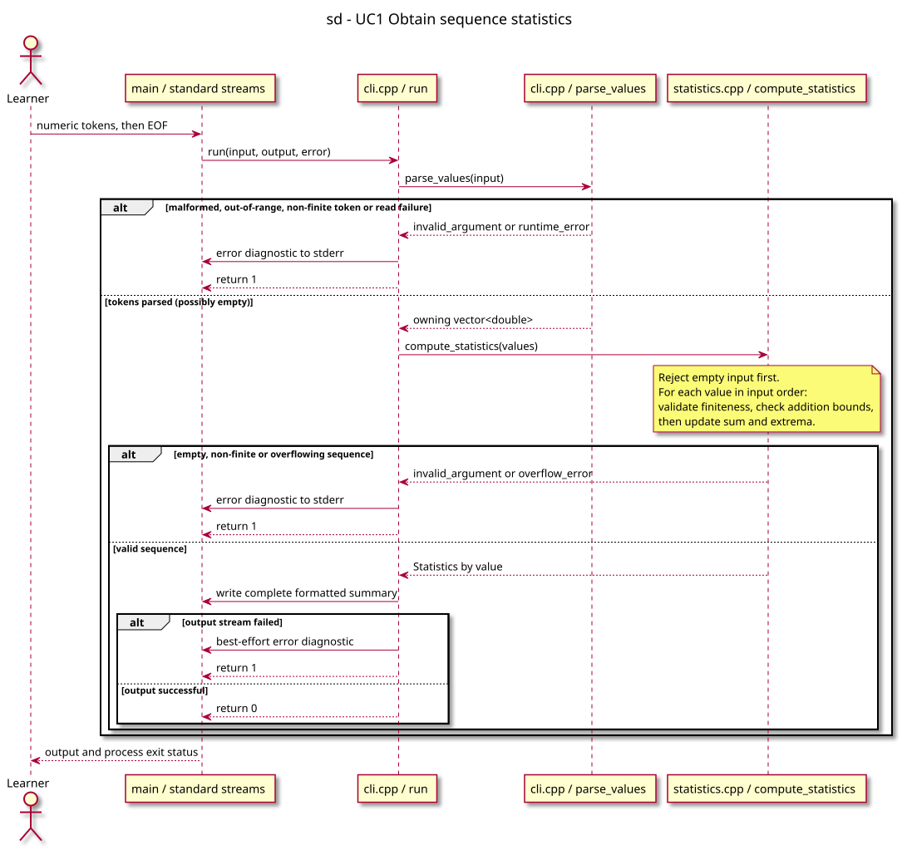

# Sequence diagram — sequence statistics

Feature: exercise 01, UC1. Status: proposed, awaiting owner validation.

Source contract: [statistics conception](../../specs/01-statistics.md). Coverage: [traceability matrix](../../traceability-matrix.md).

## Context

Shows parsing, computation, and output alternatives across the CLI and computation boundary. Participants for free functions identify execution roles, not invented classes.

## Diagram

[Authoritative PlantUML source](02-sequence-compute.puml).

## Notes

Names and behavior must match the accepted contract. The implementation is still pending. Regenerate the SVG from PlantUML after every diagram change; never edit the SVG manually.
