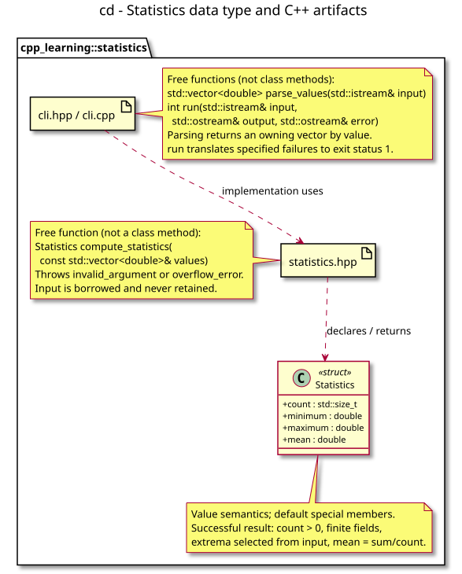

# Class and artifacts diagram — sequence statistics

Feature: exercise 01, UC1. Status: proposed, awaiting owner validation.

Source contract: [statistics conception](../../specs/01-statistics.md). Coverage: [traceability matrix](../../traceability-matrix.md).

## Context

Defines the actual result type and free-function declarations. Artifacts avoid misrepresenting C++ namespace functions as static class methods.

## Diagram

[Authoritative PlantUML source](04-class.puml).

## Notes

Names and behavior must match the accepted contract. The implementation is still pending. Regenerate the SVG from PlantUML after every diagram change; never edit the SVG manually.
