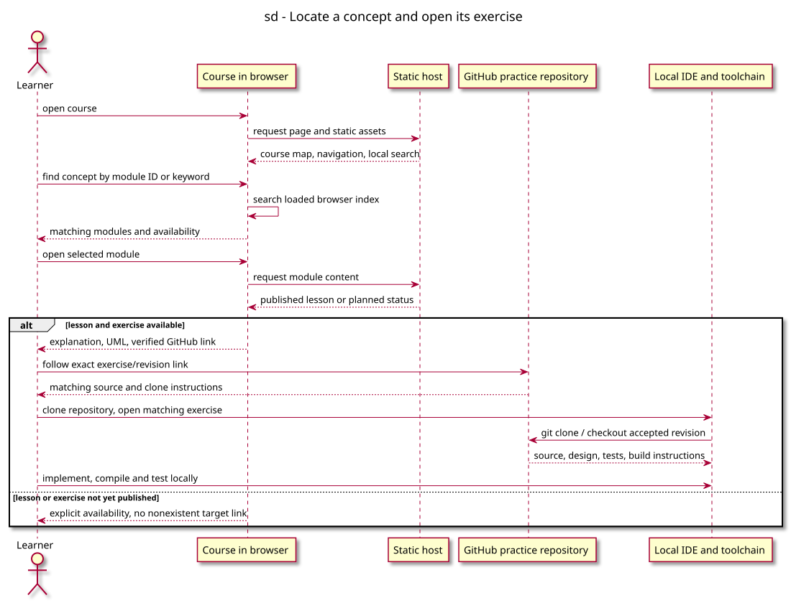

# Sequence diagram — course website

Status: proposed. Source: [website conception](../../specs/course-website.md).

## Context

Shows concept lookup and the distinction between an available exercise and a planned outline. Addresses WEB-01 through WEB-06.

## Diagram

[PlantUML source](02-sequence-open-exercise.puml).

## Notes

Hosting and framework choices remain proposed. Content language is French; engineering artifacts and source code remain English. No application implementation exists yet.
