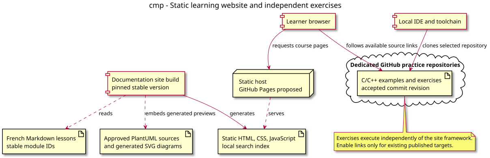

# Component diagram — course website

Status: proposed. Source: [website conception](../../specs/course-website.md).

## Context

Separates course authoring/build, static delivery, and independently executable exercise code. Addresses WEB-03 and WEB-04 without adding a backend.

## Diagram

[PlantUML source](03-component.puml).

## Notes

Hosting and framework choices remain proposed. Content language is French; engineering artifacts and source code remain English. No application implementation exists yet.
