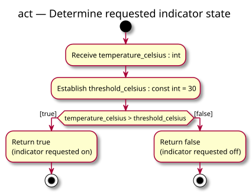

# Activity diagram — threshold indicator

> Source specification: [Threshold indicator](../../specs/threshold-indicator.md), requirements R1–R4.
> Status: proposed for owner validation.
> Decisions captured: strict threshold, pure function, integer input and Boolean output.

## Context

This view describes one call to the proposed `learning::should_light_indicator` function. Input is supplied by the caller; receiving it does not mean reading a sensor or terminal. Returning a Boolean does not switch a physical output.

## Diagram

[PlantUML source](01-activity-decision.puml)

## Notes

- Exactly 30 follows the false guard.
- Guards cover all representable integer inputs and do not overlap.
- Each path ends the activity with one Boolean result.
- No previous call affects this decision; no class or state machine is required.
- The specification contains the symbol mapping, proposed files and acceptance tests.
